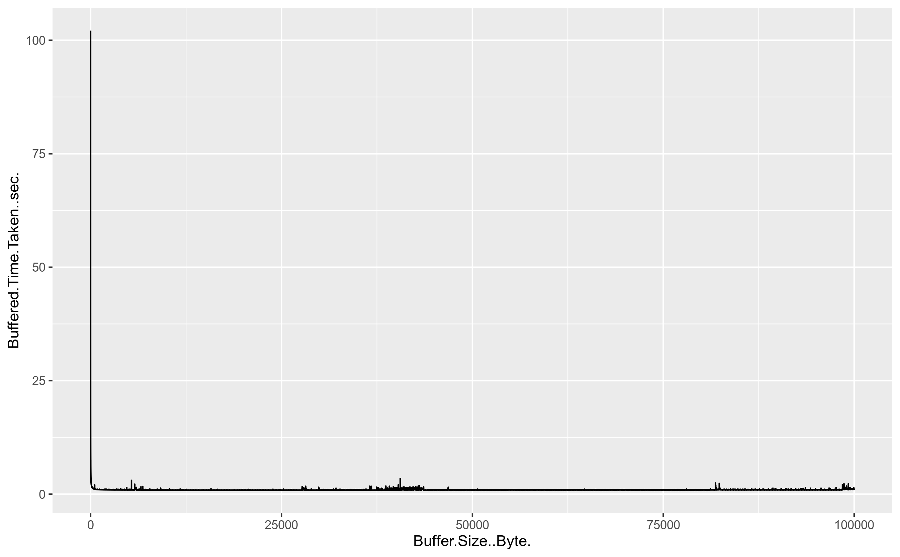
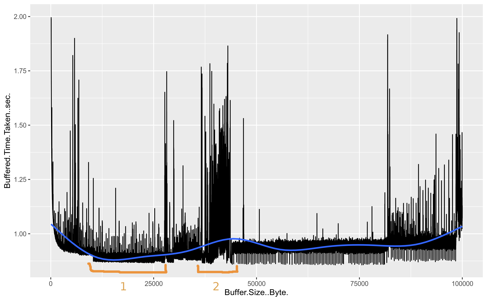
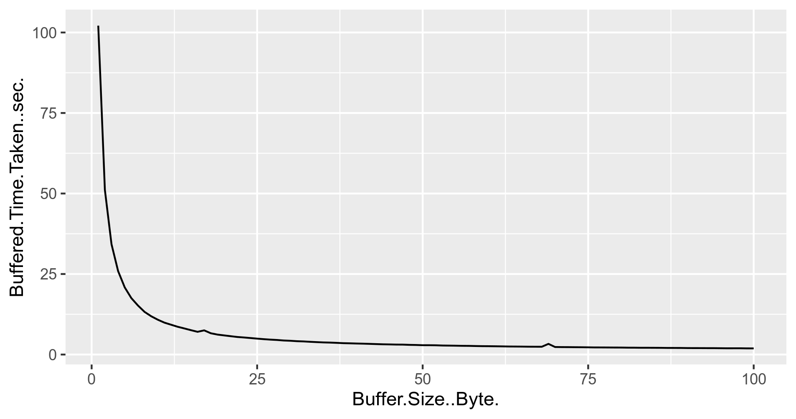
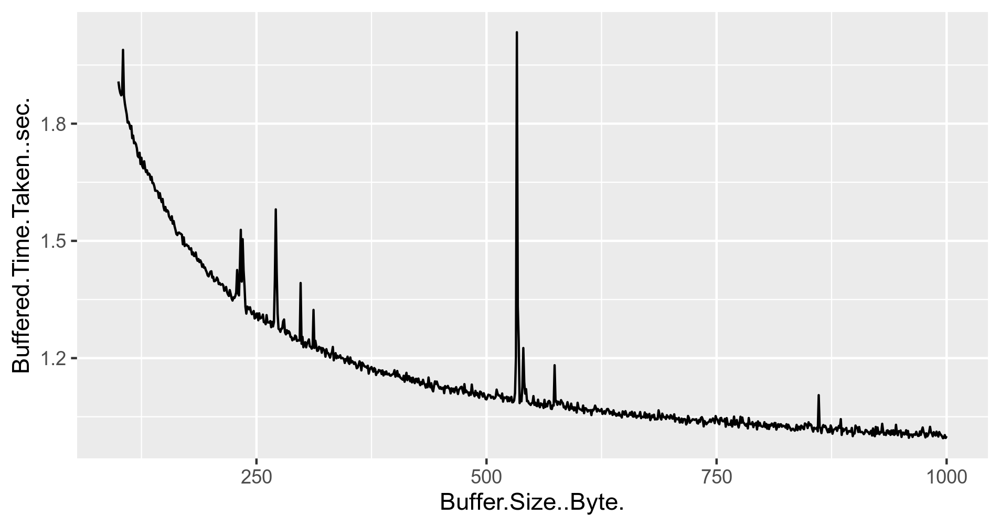
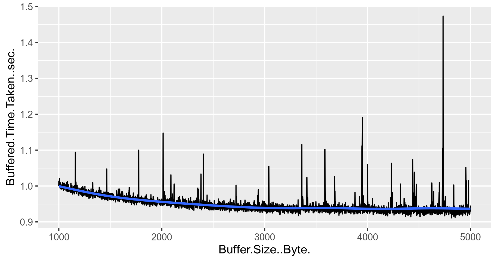
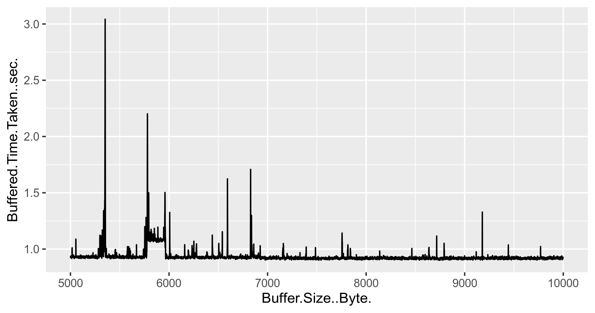
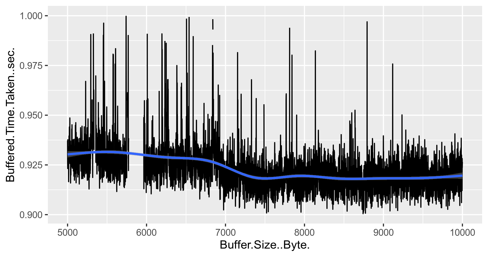
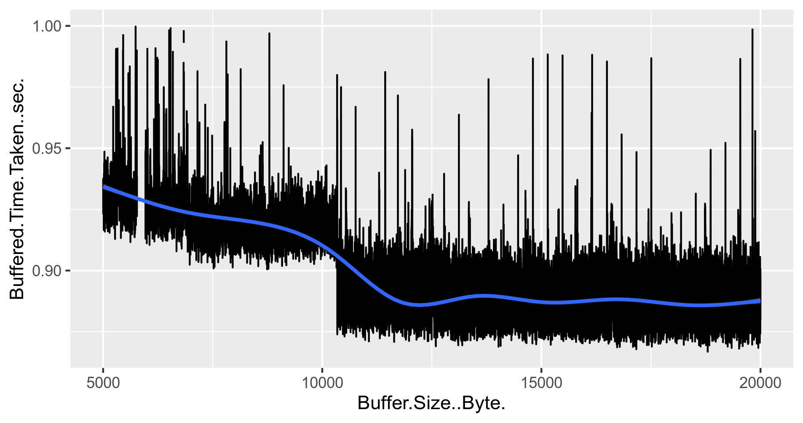
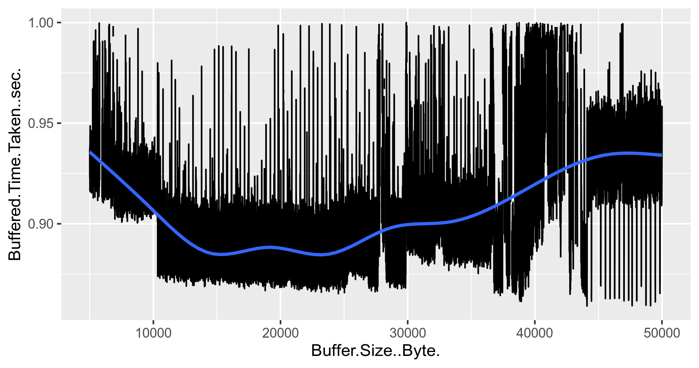

# Observation of Reading File with different buffer memory size

To start our observation let us start with the basic graph of entire data-points generated by java code.

 

As you can see in the above graph, relatively high time is taken to read the file for initial few buffer size values and suddenly there is a drop in it, and then graph stayed near to zero all the time. Therefore, it is not making sense. Let us break it down by placing upper cap of `2 sec` and how graph changes.

 

In the above graph, 90 data-points have been discarded because they held beyond `2 secs` latency. The blue curve on the graph represents the smoothed curve of the observation. If you look at two sections highlighted in the orange colour:
1. `Section-1` : The initial of this shows a sudden dip in the graph and shows are lowest of all latency shown in the graph.
2. `Section-2` : This section shows the average maximum latency in aggregation among all the data-points collected.

We will study these two section in details, whereas before that let us look into some other graphs as well and study their behaviour.

### Buffer Size [1:100] 

If you look closely, this graph look more of a derivative of `1/x` graph. A small change in buffer size reflects a hugh change in an overall latency.

### Buffer Size [100:1000]

The graph is still down going, although the steepness is reduced compare to the `Buffer Size [1:100]` graph, and maximum latency is under `2 secs`.

### Buffer Size [1000:5000]

In this graph the latency stays between `0.9` and `1.0` sec and as it cross 3000 bytes, it sort of gets saturated. If we compare it with the second picture from top *(which has two sections mentioned in orange)*, there is still an area of improvement as we have not touched the buffer size captured in section-1. Therefore, let us go further. 

### Buffer Size [5000:10000]

This graph is not favouring the latency in either ways. One possible explanation could be some variance outlier latency data present in the data-set. Therefore, let us remove those by keeping the upper cap to `1 sec` and see how the graph changes its behaviour.

Now, this graph still supports the downward going trend of latency start in mid of 7000 and 8000 buffer size and then latency seemed to follow straight path. 

### Buffer Size [5000:20000]
Let us take a bigger size a see how things are going there. To avoid outlier in graph we have kept the maximum latency till `1 sec`. 

After crossing `10,000` the graph again shows a dip, then stays consistent. 

### Buffer Size [5000:50000]
 

On taking the larger pattern, we can see the graph tends to move upwards after crossing `~28,000` buffer size. On taking reference from top second graph beyond `50,000` buffer size the graph was upwards trending. Therefore, we are not going to deep dive there.  

